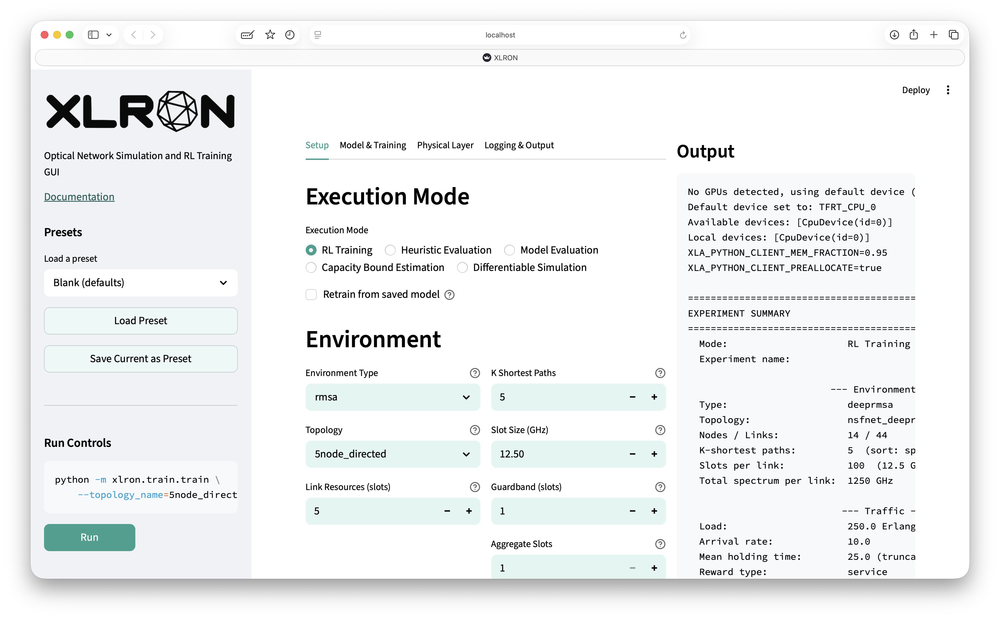

[](https://github.com/micdoh/ONDRLax/LICENSE)
[](https://github.com/psf/black)
[](https://codecov.io/gh/micdoh/XLRON)


# [DOCUMENTATION](https://micdoh.github.io/XLRON/):
## [https://micdoh.github.io/XLRON/](https://micdoh.github.io/XLRON/)

---

> ## 🎉 XLRON v1.0.0 is here! 🎉
>
> The new major release of XLRON is now out. Highlights:
>
> - **Browser GUI** — every option, every execution mode, every preset, exposed via a tabbed Streamlit app. Run `xlron` and point your browser at the URL.
> - **Graph Transformer policy** with Wavelet-Induced Rotary Encodings (WiRE) — the first transformer trained from scratch with RL to consistently match or beat the strongest heuristics on dynamic RMSA.
> - **Fast ISRS GN model** with **distributed Raman amplification (DRA)**, Nyquist subchannels, and EGN correction — validated to within 0.5 dB against the Gerard *et al.* 2025 record-throughput C+L-band experiment.
> - **End-to-end differentiable simulation** — gradients flow through the physical layer and resource-allocation logic, enabling gradient-based pump power optimisation and direct RSA optimisation.
> - **All 119 real-world TopologyBench topologies** bundled out of the box, including USA100 (100 nodes) and TataInd (143 nodes).
> - **6 × 10⁶ steps/s** on a single A100; **222–1,494×** wall-clock speedup over DeepRMSA / Optical-RL-Gym for end-to-end RL training.
> - **Updated documentation site** at <https://micdoh.github.io/XLRON/> with reproduction guides for every paper.
>
> **See the full release notes:** [GitHub release v1.0.0](https://github.com/micdoh/XLRON/releases/tag/v1.0.0).

---

<p align="center">
  <a href="https://github.com/micdoh/XLRON/raw/main/docs/images/demos/deeprmsa_transformer.mp4">
    
  </a>
  <br>
  <em>Live render of the per-link spectrum allocations made by a <a href="https://micdoh.github.io/XLRON/features/transformer/">Graph Transformer agent</a> trained with RL on DeepRMSA-NSFNET. Click for the full-resolution video.</em>
</p>

---

## Overview

**XLRON** ("ex-el-er-on") is a JAX-based simulation framework for resource allocation in optical networks. It combines a fast simulation engine that runs entirely on accelerator hardware, an integrated PPO trainer, classical heuristics, capacity bound estimators, an end-to-end differentiable physical layer, and a browser GUI — all in one library. See the docs: https://micdoh.github.io/XLRON/

### Why XLRON

- **Fast.** 222–1,494× faster end-to-end RL training than DeepRMSA / Optical-RL-Gym; up to **6 × 10⁶ steps/s** on a single A100. ([benchmarks](https://micdoh.github.io/XLRON/features/speed/))
- **Most comprehensive feature set** of any open-source optical-network simulation library. ([feature comparison](https://micdoh.github.io/XLRON/features/speed/))
- **Accurate physical layer** — closed-form **ISRS GN model with distributed Raman amplification, Nyquist subchannels, and EGN correction**, validated to within 0.5 dB against the Gerard *et al.* 2025 record-throughput C+L-band experiment. ([physical layer](https://micdoh.github.io/XLRON/features/physical_layer/))
- **First fully differentiable optical-network simulator.** Gradients flow end-to-end through the physical layer and resource-allocation logic, enabling gradient-based pump power optimisation and direct RSA optimisation. ([differentiable simulation](https://micdoh.github.io/XLRON/features/differentiable/))
- **All 119 real-world topologies from [TopologyBench](https://github.com/TopologyBench/Real-Topologies)** bundled out of the box, including very large ones like USA100 (100 nodes) and TataInd (143 nodes). ([topologies](https://micdoh.github.io/XLRON/features/topologies/))
- **Graph Transformer policy** with Wavelet-Induced Rotary Encodings (WiRE) — the first transformer trained from scratch with RL to consistently match or beat strong heuristics on dynamic RMSA. ([transformer](https://micdoh.github.io/XLRON/features/transformer/))
- **Browser GUI** exposing every option via tabbed configuration, presets, and live output streams. Run `xlron` and point your browser at the URL. ([GUI](https://micdoh.github.io/XLRON/features/gui/))
- Everything is also driven by a flat **CLI** that integrates cleanly with W&B sweeps, batch jobs, and LLM-based coding agents.

### XLRON GUI



### Papers and reproduction guides

- **XLRON: Accelerated Reinforcement Learning Environments for Optical Networks** — OFC 2024, [`ofc_paper.pdf`](ofc_paper.pdf)
- **Reinforcement Learning with Graph Attention for Routing and Wavelength Assignment with Lightpath Reuse** — ONDM 2025 ([arXiv:2502.14741](https://arxiv.org/abs/2502.14741)) — [reproduce](https://micdoh.github.io/XLRON/reproduce_rwalr/)
- **Reinforcement Learning for Dynamic Resource Allocation in Optical Networks: Hype or Hope?** — JOCN **17**(9), D1 (2025), DOI [10.1364/JOCN.559990](https://doi.org/10.1364/JOCN.559990), [arXiv:2406.01919](https://arxiv.org/abs/2406.01919) — [reproduce](https://micdoh.github.io/XLRON/reproduce_jocn2024/)
- **Comparison of Dynamic Elastic Optical Network Capacity Bound Estimation Methods** — *submitted to ECOC 2026* — [reproduce](https://micdoh.github.io/XLRON/reproduce_ecoc2026/)
- **XLRON: A Framework for Hardware-Accelerated and Differentiable Simulation of Optical Networks** — *in preparation* — [reproduce](https://micdoh.github.io/XLRON/reproduce_jocn_xlron/)
- **Graph Transformers and Stabilized Reinforcement Learning for Large-Scale Dynamic Routing, Modulation and Spectrum Allocation in Elastic Optical Networks** — *in preparation* — [reproduce](https://micdoh.github.io/XLRON/reproduce_jocn_transformer/)

Full list with BibTeX entries on the [Papers](https://micdoh.github.io/XLRON/papers/) page.

---

## Installation

```bash
# Clone the repository
git clone https://github.com/micdoh/XLRON.git
cd XLRON

# Install with uv (recommended)
uv sync

# Install dev dependencies
uv sync --group dev

# If running on GPU
uv sync --group gpu

# If running on TPU
uv sync --group tpu
```

---

## Quick Start

### GUI (recommended for new users)

XLRON includes a browser-based GUI for configuring and launching experiments without memorising CLI flags. Install dependencies, then run:

```bash
xlron
```

This opens a Streamlit app where you can select environment type, topology, traffic parameters, model architecture, PPO hyperparameters, and more — then launch runs directly from the browser. Output streams live in the right-hand pane.

**Remote server?** Use SSH port forwarding (`ssh -L <port>:localhost:<port> user@remote-host`) and open the URL in your local browser.

### Training an RL Agent (CLI)

Train a PPO agent on the RMSA problem with the NSFNET topology:

```bash
python -m xlron.train.train \
  --env_type=rmsa \
  --topology_name=nsfnet_deeprmsa_directed \
  --link_resources=100 \
  --k=50 \
  --load=250 \
  --continuous_operation \
  --ENV_WARMUP_STEPS=3000 \
  --TOTAL_TIMESTEPS=5000000 \
  --NUM_ENVS=64 \
  --LR=5e-4
```

See the full **[Training with PPO](https://micdoh.github.io/XLRON/training/)** guide for details on hyperparameters, model architectures (MLP, GNN, Transformer), algorithmic features (reward centering, prioritized sampling, VTrace), schedules, and more.

### Evaluating Heuristics

Evaluate classical heuristic algorithms without training:

```bash
python -m xlron.train.train \
  --env_type=rmsa \
  --topology_name=nsfnet_deeprmsa_directed \
  --link_resources=100 \
  --k=50 \
  --load=250 \
  --continuous_operation \
  --ENV_WARMUP_STEPS=3000 \
  --TOTAL_TIMESTEPS=20000000 \
  --NUM_ENVS=2000 \
  --EVAL_HEURISTIC \
  --path_heuristic=ksp_ff
```

See the full **[Heuristic Evaluation](https://micdoh.github.io/XLRON/heuristic_evaluation/)** guide for all available heuristics, traffic configuration, and examples.

### Capacity Bound Estimation

Estimate theoretical performance bounds using cut-set or reconfigurable routing methods:

```bash
# Cut-set bounds
python -m xlron.bounds.cutsets_bounds \
  --topology_name=nsfnet_deeprmsa_directed \
  --env_type=rmsa \
  --link_resources=100 --k=50 --load=250 \
  --continuous_operation --truncate_holding_time \
  --num_sim_requests=100000 --num_trials=10 \
  --sim_min_load=150 --sim_max_load=300 --sim_step_load=10 \
  --CUTSET_EXHAUSTIVE --CUTSET_TOP_K=256

# Reconfigurable routing bounds
python xlron/bounds/reconfigurable_routing_bounds.py \
  --topology_name=nsfnet_deeprmsa_directed \
  --env_type=rmsa \
  --link_resources=100 --k=50 --load=250 \
  --continuous_operation --truncate_holding_time \
  --path_heuristic=ksp_ff \
  --TOTAL_TIMESTEPS=13000 --NUM_ENVS=1 --COMPILE_RR_BOUNDS
```

See the full **[Capacity Bound Estimation](https://micdoh.github.io/XLRON/capacity_bounds/)** guide for details.

---

## Features

### Environment Types

| Environment | Description |
|-------------|-------------|
| `rsa` | Routing and Spectrum Assignment |
| `rmsa` | Routing, Modulation and Spectrum Assignment |
| `rwa` | Routing and Wavelength Assignment (convenience wrapper: unit bandwidth, slot size 1) |
| `deeprmsa` | DeepRMSA-compatible observation/action space |
| `rwa_lightpath_reuse` | RWA with lightpath reuse |
| `rsa_gn_model` / `rmsa_gn_model` | With GN model physical layer impairments |
| `rsa_multiband` | Multi-band transmission |

### Network Topologies — including all 119 from TopologyBench

XLRON ships with **all 119 real-world optical network topologies from [TopologyBench](https://github.com/TopologyBench/Real-Topologies)** (Matzner *et al.* 2024) bundled out of the box, in both directed and undirected variants. This means you can run any experiment on networks ranging from small academic topologies up to USA100 (100 nodes, 342 directed links) and TataInd (143 nodes, 362 directed links) just by changing one flag:

```bash
python -m xlron.train.train --topology_name=coronet_directed ...
python -m xlron.train.train --topology_name=geant_undirected ...
python -m xlron.train.train --topology_name=usa100_directed ...
python -m xlron.train.train --topology_name=tataind_directed ...
```

The historically standard research topologies are also bundled:

- **NSFNET** (`nsfnet_deeprmsa_directed`, `nsfnet_deeprmsa_undirected`, `nsfnet_nevin_undirected`)
- **COST239** (`cost239_deeprmsa_directed`, `cost239_ptrnet_real_undirected`, etc.)
- **USNET** (`usnet_gcnrnn_directed`, `usnet_ptrnet_undirected`, etc.)
- **JPN48** (`jpn48_directed`, `jpn48_undirected`)
- **German17** (`german17_directed`, `german17_undirected`)
- **CONUS** (`conus_directed`, `conus_undirected`)
- **5-node** (`5node_directed`, `5node_undirected`)
- Custom topologies via `--topology_directory`

To list all available TopologyBench topologies or regenerate from source:

```bash
python xlron/data/topologies/topology_bench_to_xlron_conversion.py --list
python xlron/data/topologies/topology_bench_to_xlron_conversion.py --download  # re-download from upstream
```

Optional topology node attributes (`latitude`, `longitude`) are used by `render` for geographic layouts.

If you use the TopologyBench topologies in published work, please also cite TopologyBench: <https://github.com/TopologyBench/Real-Topologies>.

### Model Architectures

- **MLP** (default) -- simple multi-layer perceptron
- **GNN** (`--USE_GNN`) -- Jraph-based graph neural network with optional GATv2 attention
- **Transformer** (`--USE_TRANSFORMER`) -- transformer encoder with WIRE graph-aware positional encodings

### Physical Layer Modeling

The `rsa_gn_model` and `rmsa_gn_model` environments include a closed-form ISRS GN model for estimating physical layer impairments (SNR). This enables modulation format selection based on estimated path GSNR and launch power optimization:

```bash
python -m xlron.train.train \
  --env_type=rmsa_gn_model \
  --topology_name=nsfnet_deeprmsa_directed \
  --link_resources=100 \
  --snr_margin=0.5 \
  --launch_power_type=fixed \
  ...
```

### Differentiable Mode

XLRON supports differentiable operations for gradient-based optimization through the environment. This is useful for research into differentiable discrete optimization and end-to-end learning.

```bash
python -m xlron.train.train \
  --env_type=rmsa \
  --topology_name=nsfnet_deeprmsa_directed \
  --differentiable \
  --temperature=1.0 \
  ...
```

When `--differentiable` is enabled, discrete operations (comparisons, argmax, indexing, rounding) use differentiable approximations based on straight-through gradient estimators and temperature-controlled soft functions (sigmoid, softmax). When disabled (default), standard non-differentiable operations are used for maximum performance.

---

## Project Structure

```
xlron/
├── environments/           # JAX-based optical network environments
│   ├── dataclasses.py     # Flax struct dataclasses for state/params
│   ├── env_funcs.py       # Core environment functions
│   ├── diff_utils.py      # Differentiable operation approximations
│   ├── make_env.py        # Environment factory
│   └── wrappers.py        # Gym-style wrappers
├── train/
│   ├── train.py           # Main training entry point
│   ├── train_utils.py     # Training utilities
│   └── ppo.py             # PPO implementation
├── heuristics/            # Classical algorithms (KSP-FF, etc.)
├── bounds/                # Capacity bound estimation (cut-sets, reconfigurable routing)
├── models/                # Neural network architectures (MLP, GNN, Transformer)
├── gui/                   # Streamlit GUI (optional, install with `xlron[gui]`)
├── dtype_config.py        # Device-aware dtype configuration
└── parameter_flags.py     # Command-line flags
```

---

## Acknowledgements

This work was supported by the Engineering and Physical Sciences Research Council (EPSRC) grant EP/S022139/1 - the Centre for Doctoral Training in Connected Electronic and Photonic Systems - and EPSRC Programme Grant TRANSNET (EP/R035342/1)


## License

Copyright (c) Michael Doherty 2023.
This project is licensed under the MIT License - see [LICENSE](LICENSE) file for details.
