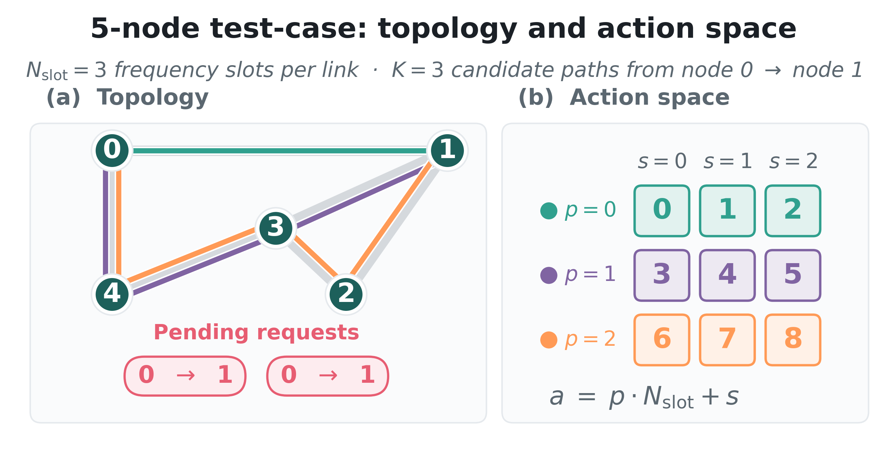
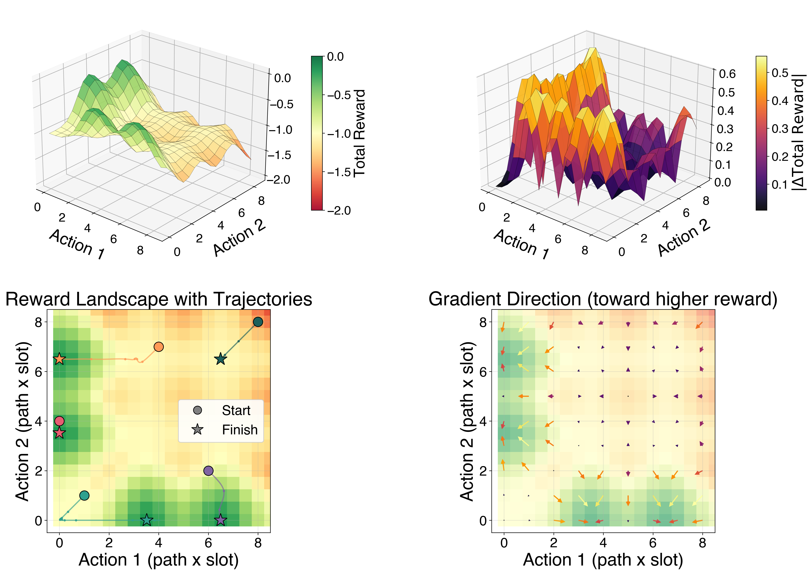
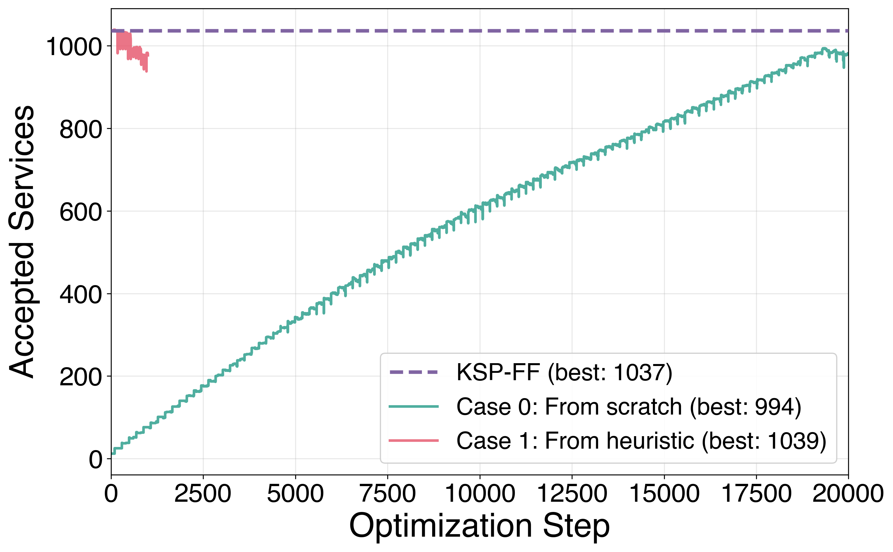

# Differentiable Simulation

XLRON is, to our knowledge, the **first fully differentiable optical-network simulator**. Both the physical layer (Raman ODE, ISRS GN integrals, Nyquist subchannels, ASE noise) and the resource allocation logic (path selection, slot assignment, action validity checks) flow gradients end-to-end. This unlocks two qualitatively new capabilities:

1. **Gradient-based optimization of continuous physical parameters** — Raman pump powers, channel launch powers, amplifier gains. See the [pump optimization result](physical_layer.md#gradient-based-raman-pump-optimization).
2. **Direct gradient-based RSA** — treating the action at each request as a continuous parameter and using the gradient of the cumulative reward to maximise accepted services.

The full mathematical detail and API are documented in [Differentiable DRA Pipeline](../differentiable_dra.md). This page summarises the published results.

---

## How it works

JAX provides automatic differentiation; the only non-trivial pieces are (a) the discrete operations in the resource-allocation logic (argmax, comparison, indexing, rounding), and (b) the iterative inner solvers in the DRA pipeline.

**Discrete operations** are handled with **straight-through gradient estimators**: the forward pass uses the exact discrete operation, the backward pass uses a differentiable, temperature-controlled approximation (softmax for argmax, sigmoid for comparison, etc.). XLRON exposes these via `xlron/environments/diff_utils.py` (see the [GN model docs](../differentiable_dra.md)).

**Iterative solvers** are wrapped with custom **JVP rules** so that, from JAX's point of view, each solver is a single differentiable operation. The Raman ODE boundary-value solve uses an Implicit Function Theorem-based reverse pass; the Levenberg–Marquardt fit uses a stop-gradient with the per-channel ODE-derived Raman gain carrying the dominant sensitivity.

Enable it on any environment with:

```bash
--differentiable --temperature=1.0
```

When `--differentiable` is set, the diff_utils functions return the smoothed gradient on the backward pass. When unset (the default), they fall through to the hard discrete operation with no overhead.

---

## Reward-landscape visualization

To build intuition for what the gradients look like in this discrete-reward setting, consider a 2-request RSA problem on a small topology:

{ width="400" .center }

The reward landscape over the two action variables is piecewise constant. The straight-through estimators produce a well-defined gradient field that points toward higher-reward regions, even though the true objective has zero gradient almost everywhere:



---

## Direct RSA optimization on NSFNET

We treat the action at each of 2,000 sequential requests on NSFNET (100 FSU, k=5, incremental loading) as a continuous parameter and optimize the joint action sequence with Adam.



- **From scratch:** with all 2,000 actions initialized to zero, the optimizer climbs from 0 → **994 accepted services** using only first-order gradients, no domain knowledge.
- **From the KSP-FF heuristic** (1,037 services): the optimizer briefly improves to **1,039** before drifting away — a window where gradient-based refinement of a heuristic solution is possible, but stability is an open challenge.

This is a hard problem: each action constrains the feasibility of every subsequent action. The result demonstrates that gradient information *is* useful for combinatorial RSA, while also showing the open research question of how best to combine gradient signal with the discrete objective. We see the most natural near-term applications in:

- Continuous physical parameters where the landscape is genuinely smooth (pump powers, launch powers — see [Physical Layer](physical_layer.md)).
- Augmenting RL training with a low-variance gradient signal rather than replacing it.
- Hybrid approaches alternating between gradient-based refinement and discrete local search.

---

Reproduce all of the above with the commands in the [XLRON framework paper reproduction guide](../reproduce_jocn_xlron.md#section-4-differentiable-simulation).
