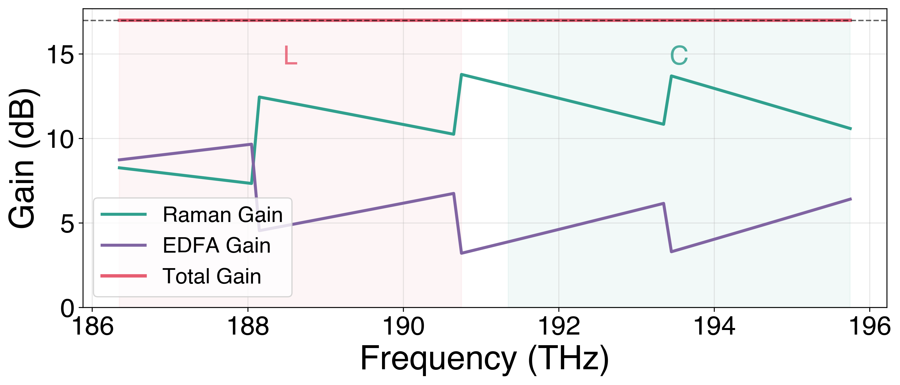
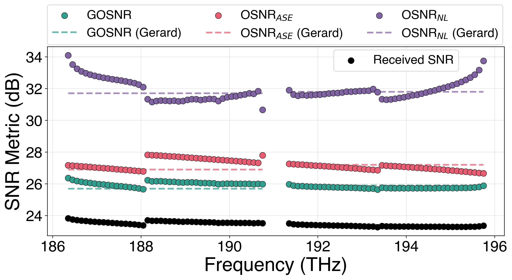
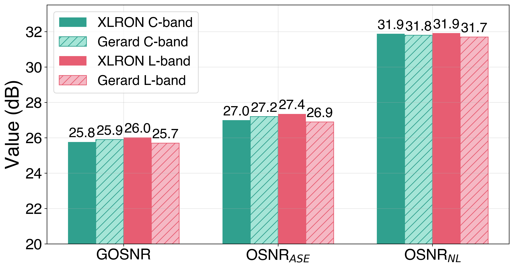
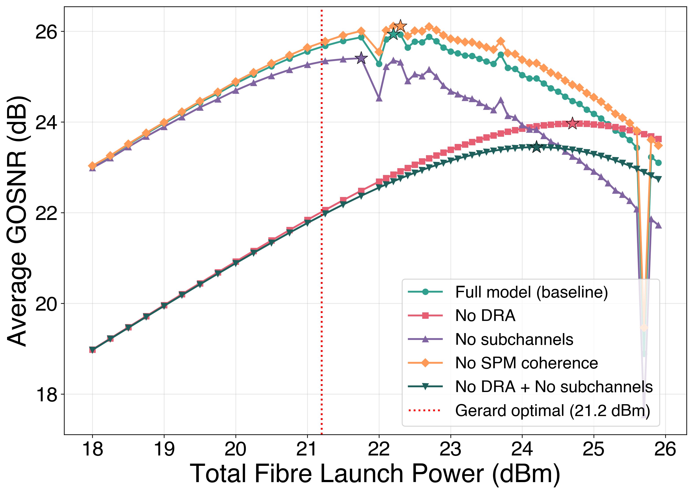
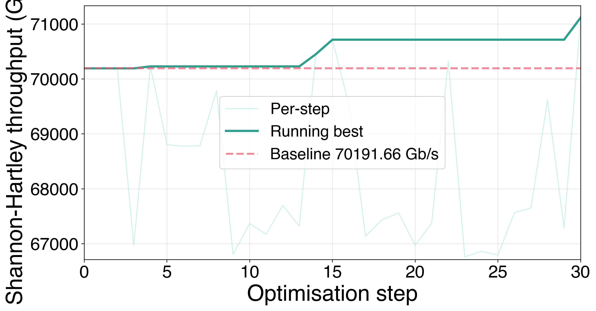

# Physical Layer Model

XLRON ships an end-to-end **closed-form ISRS GN model with distributed Raman amplification (DRA)**, Nyquist digital subchannels, EGN modulation-format correction, and a Friis-cascade noise-figure model for hybrid Raman+EDFA amplifiers. Among the open-source optical-network simulation libraries, XLRON is the only one to combine all of these features in a single physical layer model.

The model is described in detail in [GN Model Physical Layer](../gn_model.md) and [Differentiable DRA Pipeline](../differentiable_dra.md). This page summarises the validation against the Gerard *et al.* 2025 record-throughput experiment and the resulting capabilities for design and optimization.

| Feature | GNPy | XLRON |
| --- | :---: | :---: |
| GN NLI model | ✓ | ✓ |
| EGN correction (modulation format) | ✗ | ✓ |
| ISRS in GN model | Partial | ✓ |
| Distributed Raman | ✓ | ✓ |
| Nyquist subchannels | ✗ | ✓ |
| ASE noise | ✓ | ✓ |
| Multi-band | Partial | ✓ |
| Polarization effects | ✓ | ✗ |
| ROADM impairments | ✓ | ✗ |
| Connector losses | ✓ | ✗ |
| Differentiable | ✗ | ✓ |

---

## Validation against Gerard et al. 2025

The Gerard *et al.* 2025 experiment demonstrated 72 Tb/s real-time transmission over 1,504 km of G.654.E TXF fiber across the C+L bands using hybrid backward-Raman + EDFA amplification — 90 channels of 100.4 GBd PCS 64-QAM, 18.4 dB span loss, ~8.7 dB Raman gain. We reconfigure XLRON's `rsa_gn_model` to match the experimental setup as closely as possible, then compare every SNR metric per channel.

**Gain budget.** Raman provides 11 dB on average, EDFA 6 dB, total 17 dB matching span loss:

**Per-channel SNR metrics** (GOSNR, OSNR_ASE, OSNR_NL, received SNR) compared against the per-band averages reported in Gerard *et al.* Table I:

**Per-band agreement** is within 0.5 dB on every metric:

| Metric | Band | XLRON | Gerard | Δ |
| --- | --- | ---: | ---: | ---: |
| GOSNR | C | 25.8 dB | 25.9 dB | 0.1 dB |
| GOSNR | L | 26.0 dB | 25.7 dB | 0.3 dB |
| OSNR_ASE | C | 27.0 dB | 27.2 dB | 0.2 dB |
| OSNR_ASE | L | 27.4 dB | 26.9 dB | 0.5 dB |
| OSNR_NL | C | 31.9 dB | 31.8 dB | 0.1 dB |
| OSNR_NL | L | 31.9 dB | 31.7 dB | 0.2 dB |

**Ablation study**: removing components of the model (DRA, Nyquist subchannels, coherent multi-span NLI accumulation) shifts the predicted optimal launch power by several dB and the GOSNR by 1–2 dB:

The full XLRON model peaks at 25.8 dB GOSNR at ~22 dBm total fibre launch power, in close agreement with Gerard's experimentally optimal 21.2 dBm.

---

## Gradient-based Raman pump optimization

Because the entire DRA + ISRS GN pipeline is differentiable end-to-end (Implicit Function Theorem for the Raman ODE solve, custom JVP for the LM profile fit, see [Differentiable DRA Pipeline](../differentiable_dra.md)), Raman pump powers can be optimized with **first-order gradient methods** instead of derivative-free PSO.

Starting from a deliberately suboptimal flat pump configuration, Adam raises the total Shannon–Hartley throughput from 70.2 Tb/s to 71.1 Tb/s within 30 iterations on a laptop CPU:

To our knowledge, XLRON is the first end-to-end differentiable physical-layer simulator for wideband ISRS GN systems with distributed Raman amplification.

---

Reproduce all of the above with the commands in the [XLRON framework paper reproduction guide](../reproduce_jocn_xlron.md#section-3-physical-layer-model-gerard-et-al-2025-validation).
