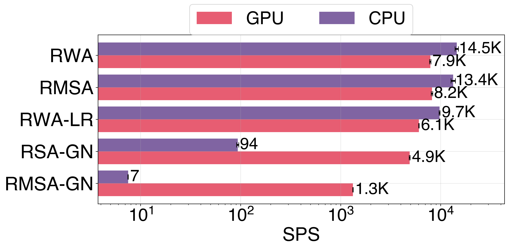
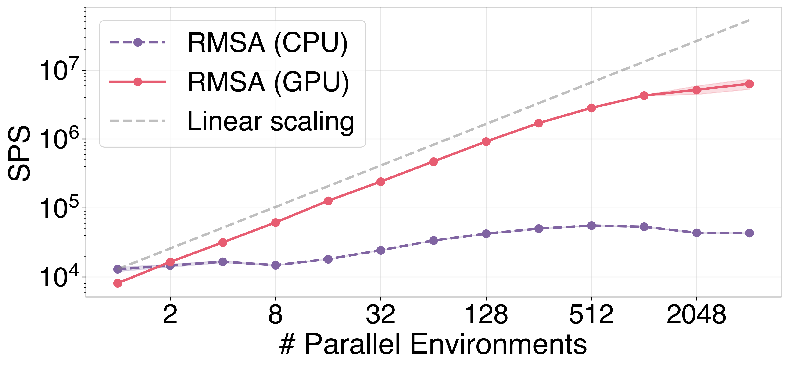
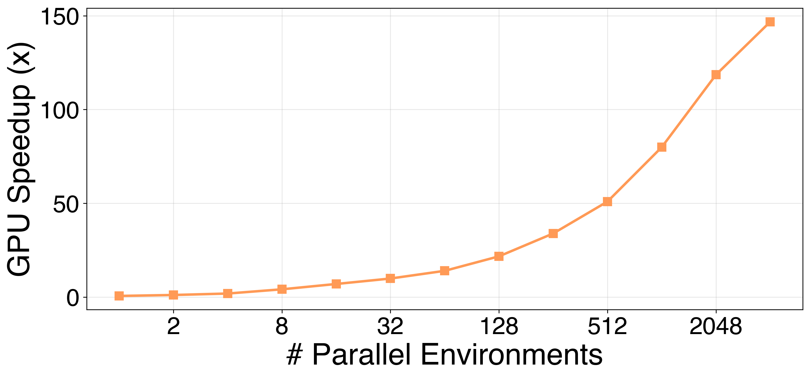
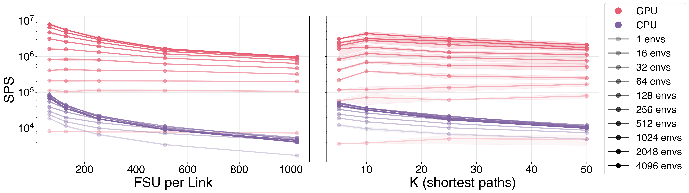
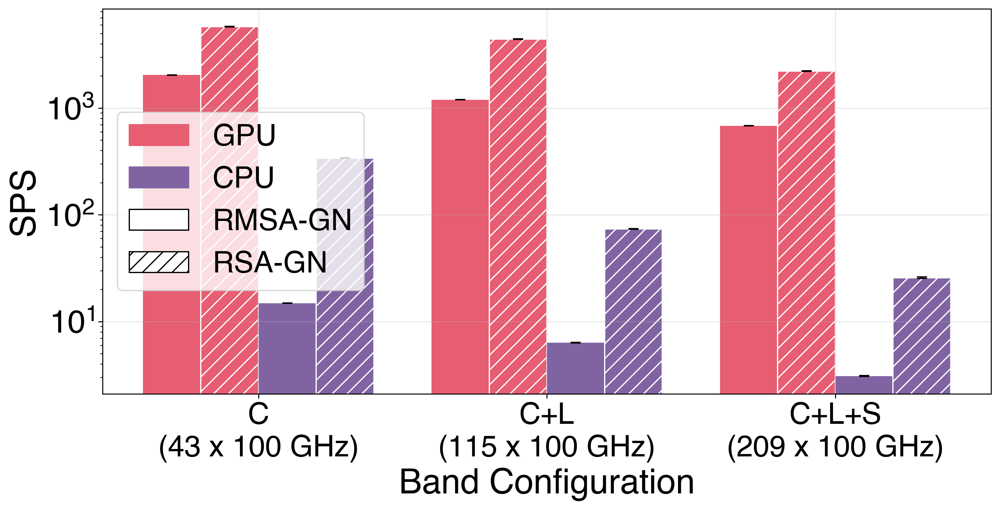
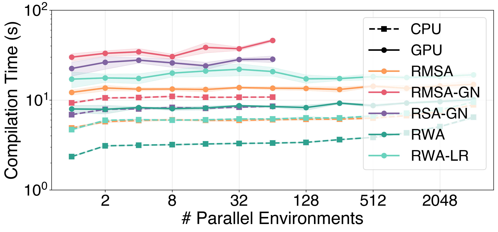
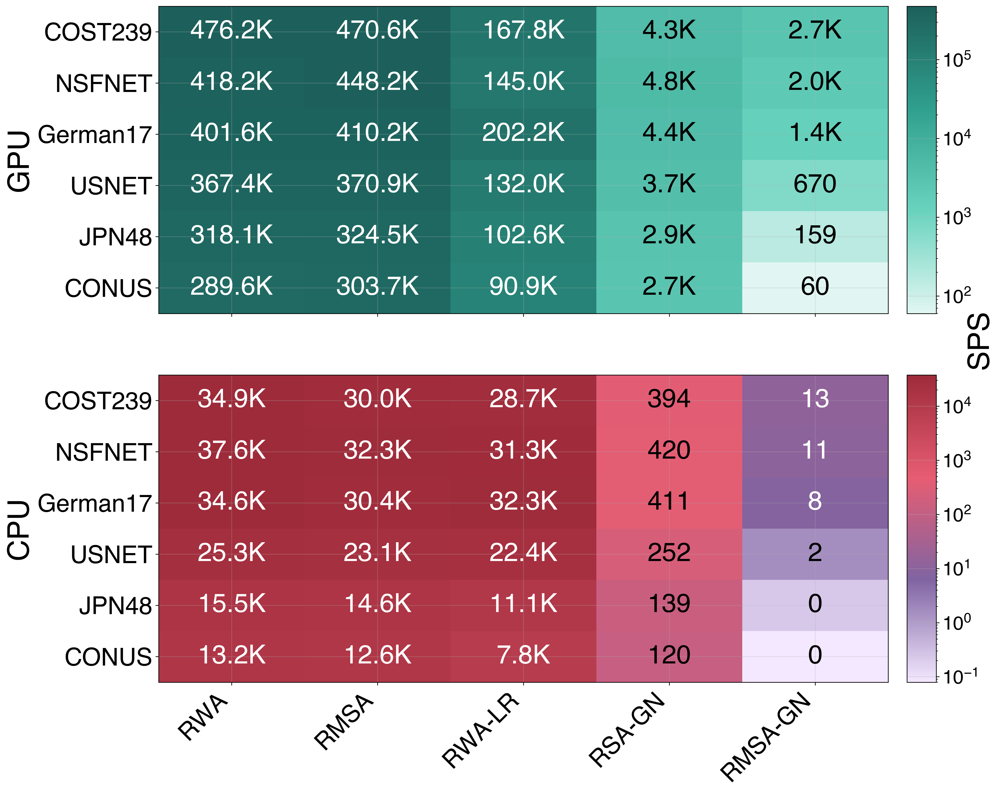
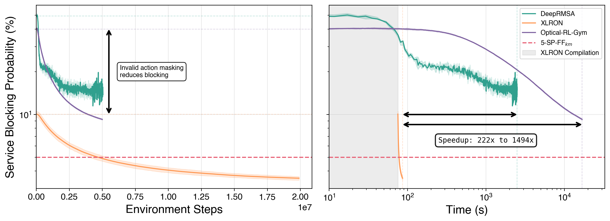

# Comparisons & Speed

XLRON is the most comprehensive open-source optical-network simulation library, and the fastest by a wide margin once GPU parallelism is engaged. The headline numbers from the forthcoming *XLRON framework* paper (in preparation; see [Papers](../papers.md)):

- **6 × 10⁶ steps/s** for RMSA on a single A100 with 2,048 parallel envs.
- **300×** higher single-device throughput than Flex Net Sim (the fastest single-core CPU library) once GPU parallelism is used.
- **222–1,494×** wall-clock speedup over DeepRMSA / Optical-RL-Gym for end-to-end RL training on the canonical DeepRMSA benchmark, while *also* achieving lower blocking via invalid action masking.

See the [XLRON framework paper reproduction guide](../reproduce_jocn_xlron.md) for the exact commands.

---

## Feature comparison with other libraries

| Feature | **XLRON** | GNPy | DeepRMSA | RSA-RL | ORL-Gym | ON-Gym | FUSION | Flex Net Sim |
| --- | :---: | :---: | :---: | :---: | :---: | :---: | :---: | :---: |
| GUI | **✓** | ✓ | ✗ | ✗ | ✗ | ✗ | ✓ | ✗ |
| RL training | **✓** | ✗ | ✓ | ✓ | ✓ | ✓ | ✓ | Ext. |
| Invalid action masking | **✓** | ✗ | ✗ | ✓ | ✗ | ✗ | ✗ | ✗ |
| Physical layer model | **EGN** | GN | ✗ | ✗ | ✗ | GN | Partial | ✗ |
| ISRS | **✓** | Partial | ✗ | ✗ | ✗ | ✗ | ✗ | ✗ |
| Distributed Raman | **✓** | ✓ | ✗ | ✗ | ✗ | ✗ | ✗ | ✗ |
| Nyquist subchannels | **✓** | ✗ | ✗ | ✗ | ✗ | ✗ | ✗ | ✗ |
| Multi-band | **✓** | Partial | ✗ | ✗ | ✗ | ✓ | Partial | Ext. |
| Differentiable simulation | **✓** | ✗ | ✗ | ✗ | ✗ | ✗ | ✗ | ✗ |
| Hardware acceleration | **GPU** | ✗ | ✗ | ✗ | ✗ | ✗ | ✗ | ✗ |
| LLM-agent support | **✓** | ✗ | ✗ | ✗ | ✗ | ✗ | ✓ | ✗ |

---

## Cross-library throughput

Throughput in steps per second (SPS) for dynamic spectrum allocation on the 14-node NSFNET topology, 100 FSU per link, KSP-FF (k=5), distance-adaptive modulation. "inc. GN" / "exc. GN" denote whether a physical-layer model is enabled.

| Library | Hardware | exc. GN | inc. GN |
| --- | --- | ---: | ---: |
| FUSION | CPU 1 core | 100 | — |
| ON-Gym | CPU 1 core | $2.7 \times 10^{1}$ | $1.3 \times 10^{2}$ |
| Flex Net Sim | CPU 1 core | $2.0 \times 10^{4}$ | — |
| GNPy | CPU 1 core | — | $3.5 \times 10^{1}$ |
| **XLRON** | CPU 1 core | $1.5 \times 10^{4}$ | $9.4 \times 10^{1}$ |
| **XLRON** | GPU, 1 env | $8.0 \times 10^{3}$ | $1.3 \times 10^{3}$ |
| **XLRON** | GPU, 2,048 envs | $\mathbf{6.0 \times 10^{6}}$ | — |

FUSION / ON-Gym / Flex Net Sim figures reproduced from Bórquez-Paredes *et al.* 2026.

---

## Throughput scaling

Throughput across XLRON's environment types (RWA, RMSA, RWA-LR, RSA-GN, RMSA-GN) on a single GPU vs CPU, with no parallelism:

Scaling with the number of parallel environments — near-linear on GPU, plateau on CPU around the core count:

GPU speedup over CPU as a function of parallel environments. Crossover at 2 envs, 150× speedup at 4,096 envs:

Sensitivity to FSU per link and number of candidate paths $k$ — XLRON degrades gracefully on GPU even up to 1,000 FSU and $k=50$:

GN-model environments scaling across band configurations (C, C+L, C+L+S):

JIT compilation cost — a one-time 3–50 s, amortised over the run:

Topology × env-type heatmap (six topologies, five environments, GPU vs CPU):

---

## End-to-end RL training: DeepRMSA reproduction

XLRON, the original DeepRMSA codebase, and Optical-RL-Gym all trained on the canonical DeepRMSA setup (NSFNET, 100 FSU, k=5, 2 × 10⁷ env steps). XLRON achieves lower blocking *and* finishes 222–1,494× sooner:

The shaded region indicates XLRON's one-time JIT compilation overhead. Invalid action masking (the dashed annotation) is what drives the lower-blocking advantage; GPU + JIT is what drives the wall-clock advantage.

---

Reproduce all of the above with the commands in the [XLRON framework paper reproduction guide](../reproduce_jocn_xlron.md).
