# Graph Transformer for Dynamic RMSA

XLRON includes a built-in **Graph Transformer** policy/value architecture (`--USE_TRANSFORMER`) with **Wavelet-Induced Rotary Encodings (WiRE)** for graph positional encoding. The architecture is described in *Graph Transformers and Stabilized Reinforcement Learning for Large-Scale Dynamic Routing, Modulation and Spectrum Allocation in Elastic Optical Networks* (Doherty, Beghelli, Toni — *in preparation*). To our knowledge, this is the first transformer trained from scratch with RL for dynamic RMSA, and the first RL method from the standard benchmarks to consistently match or beat the strongest heuristics.

The full reproduction guide is at [Reproducing the Graph Transformer paper](../reproduce_jocn_transformer.md). This page summarises the architecture and headline results.

---

## Training architecture

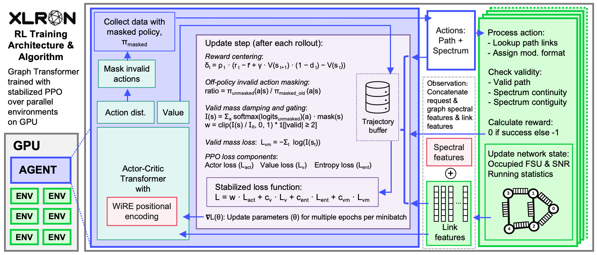

Multiple parallel environments (green) run on GPU and generate experience concurrently. At each decision step the environment exposes a sequence of tokens — one per link — encoding the link's spectrum occupancy together with features of the current request. The agent (blue) is an actor-critic Graph Transformer trained with stabilized PPO (purple), with WiRE positional encodings (red) injecting the network topology into the transformer.

Three training stabilisations are essential to training a transformer from scratch with PPO + invalid action masking:

1. **Off-policy invalid action masking** — importance ratios computed against the *unmasked* policy so gradients flow through masked actions.
2. **Valid mass stabilisation** — a log-barrier loss + per-step damping + hard gating that keep the unmasked policy from collapsing off the valid action set.
3. **Pre-LayerNorm** — eliminates the need for warm-up and keeps gradients well-behaved.

The model uses **Wavelet-Induced Rotary Encodings (WiRE)** to inject graph structure via the line-graph Laplacian spectrum:

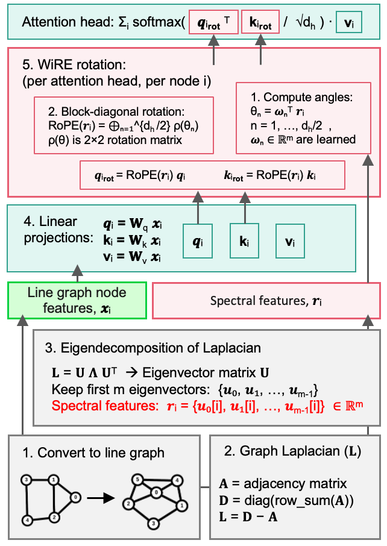

The actor uses `[min || mean || max]` pooling over a path's link tokens to produce per-action logits; the critic uses single-query attention pooling over all link tokens for value estimation:

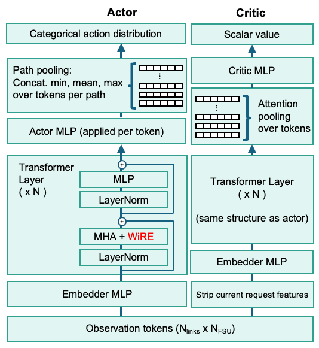

Enable on any environment with:

```bash
--USE_TRANSFORMER \
--transformer_num_layers=2 --transformer_num_heads=8 --transformer_embedding_size=128 \
--OFF_POLICY_IAM --VALID_MASS_LOSS_COEF=0.001 --VML_SCHEDULE=linear \
--SEPARATE_VF_OPTIMIZER --VF_LR=5e-5
```

---

## Side-by-side: Transformer vs KSP-FF

Both videos below are XLRON's `render` view of the same dynamic RMSA workload on NSFNET (100 FSU/link, DeepRMSA setting), played at the same speed. Each row of the spectrum panel is one link; horizontal bars are active lightpaths. The trained Graph Transformer agent (left) packs the spectrum more efficiently than KSP-FF (right), accepting more requests over the same 40-second window.

<div style="display: flex; flex-wrap: wrap; gap: 1rem; justify-content: center;">
  <figure style="margin: 0; flex: 1 1 420px; max-width: 640px; text-align: center;">
    <video autoplay loop muted playsinline preload="metadata" width="100%" aria-label="Render of resource allocation decisions taken by a Graph Transformer agent trained with RL on DeepRMSA-NSFNET">
      <source src="../../images/demos/deeprmsa_transformer.webm" type="video/webm">
      <source src="../../images/demos/deeprmsa_transformer.mp4" type="video/mp4">
      Your browser does not support HTML5 video.
    </video>
    <figcaption><strong>Graph Transformer (RL-trained)</strong></figcaption>
  </figure>
  <figure style="margin: 0; flex: 1 1 420px; max-width: 640px; text-align: center;">
    <video autoplay loop muted playsinline preload="metadata" width="100%" aria-label="Render of resource allocation decisions taken by the KSP-FF heuristic on DeepRMSA-NSFNET">
      <source src="../../images/demos/deeprmsa_kspff.webm" type="video/webm">
      <source src="../../images/demos/deeprmsa_kspff.mp4" type="video/mp4">
      Your browser does not support HTML5 video.
    </video>
    <figcaption><strong>KSP-FF heuristic</strong></figcaption>
  </figure>
</div>

---

## Benchmark comparison

Five highly-cited RL-for-RMSA papers (DeepRMSA, RewardRMSA, GCN-RMSA, MaskRSA, PtrNet-RSA), the strongest KSP-FF / FF-KSP heuristic in each setting, and two capacity bound estimates (cut-set and reconfigurable-routing) compared to the Graph Transformer:

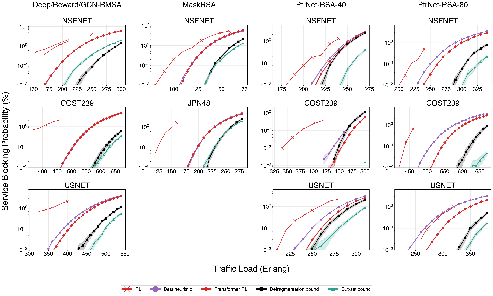

The Graph Transformer (red squares) is the **first method from the benchmark set** to consistently match or exceed the strongest heuristic (purple) across NSFNET, COST239, USNET and JPN48. The largest improvement is on PtrNet-RSA-80 USNET, where the Transformer supports **13% higher load** at the heuristic's blocking probability. On PtrNet-RSA-40 COST239 the Transformer even dips *below* the defragmentation bound — strong evidence of a learned routing policy that beats what greedy reallocation can recover.

---

## Scaling to large topologies

The same architecture scales to the largest dynamic RMSA instances ever attempted with RL: **USA100** (100 nodes, 342 links) and **TataInd** (143 nodes, 362 links) from [TopologyBench](https://github.com/TopologyBench/Real-Topologies):

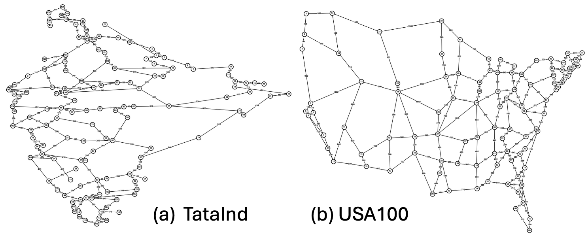

At a target blocking of 0.1%, the Transformer supports **~4% higher load on USA100** and **~3% higher on TataInd** than the strongest FF-KSP heuristic (`K`=70 / `K`=90):

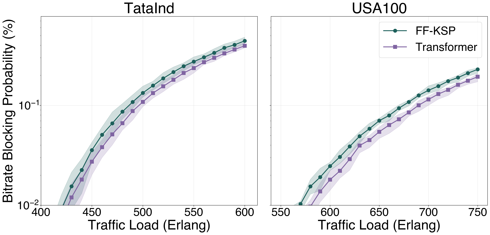

The transient and steady-state behaviour during a single 100k-request episode:

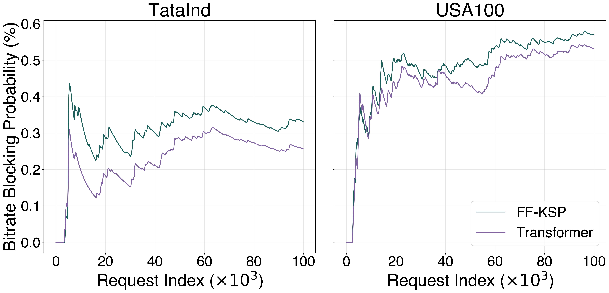

### Ablation study

Off-policy invalid action masking and per-step loss damping are the load-bearing components — without them the policy fails to converge or collapses late in training:

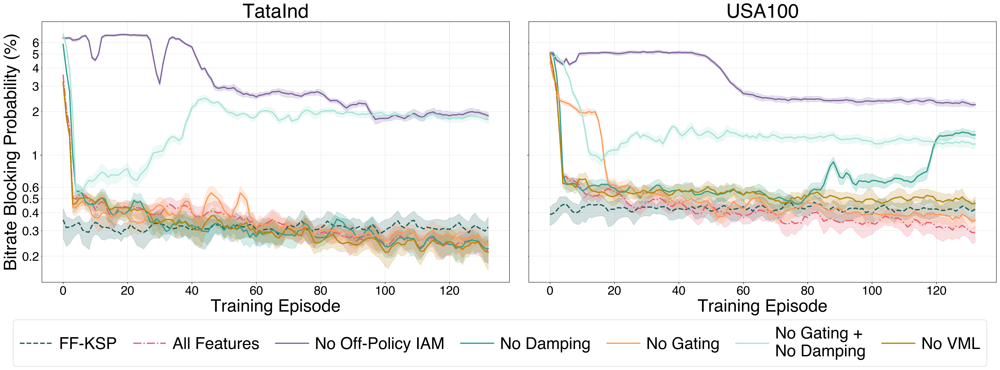

### Loss dynamics

Decomposition of the total training loss into actor / valid-mass / value / entropy components for both topologies — smooth dynamics throughout the 40M-step run:

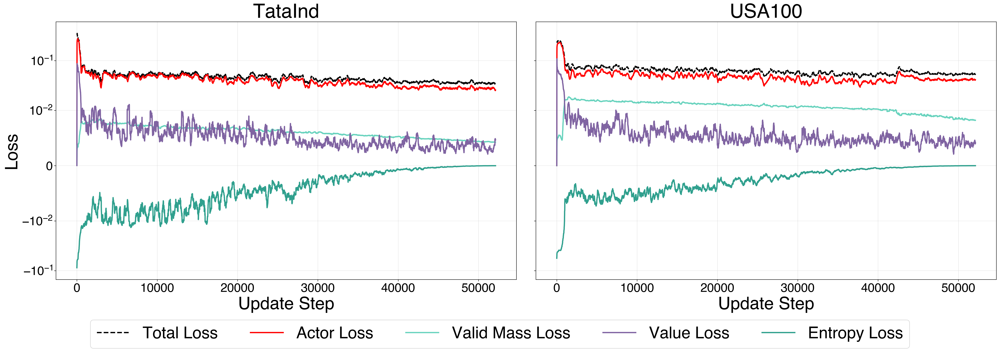

### Learned routing strategy

The Transformer learns to combine the spectral efficiency of KSP-FF (preferring shorter paths) with the route diversity of FF-KSP. On USA100 the per-request path-length delta is consistently negative (Transformer chooses shorter paths than FF-KSP) by 100–200 km / 0.2–0.3 hops; on TataInd the distributions are nearly identical:

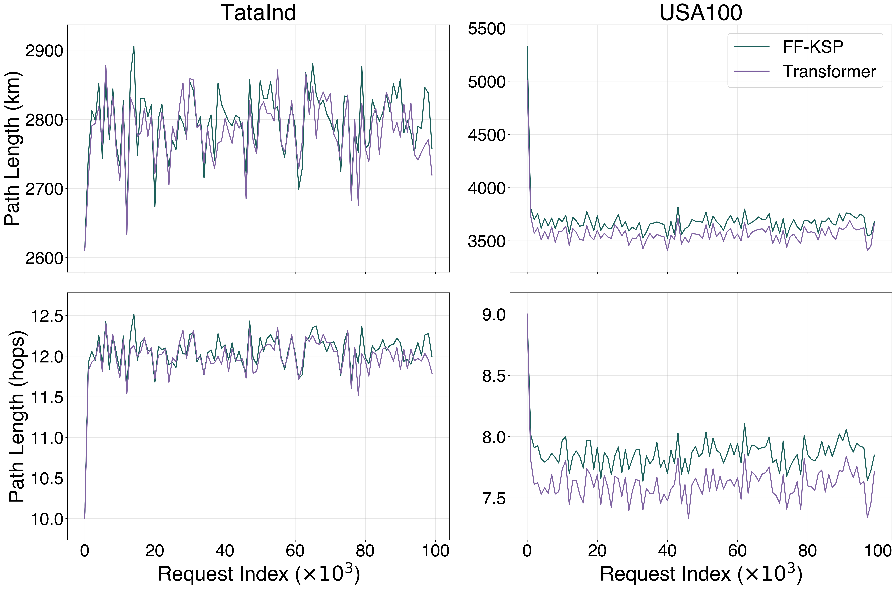

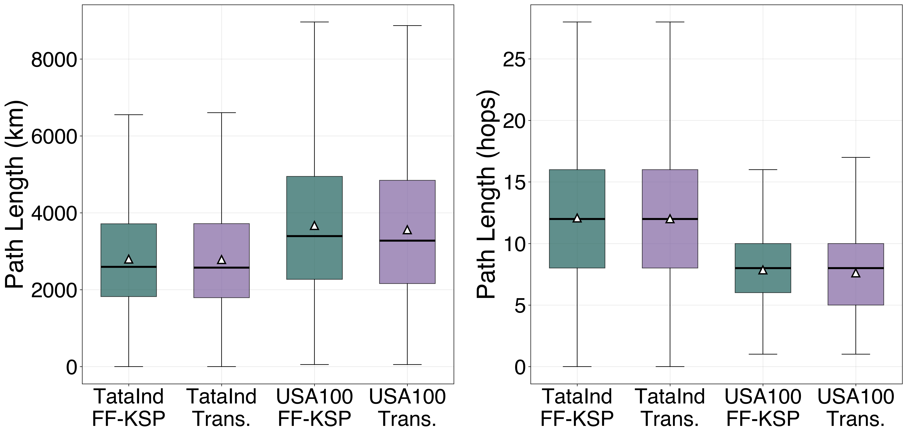

The spectral occupancy heatmaps show the Transformer distributing load away from the low-FSU end of the spectrum (where FF-KSP concentrates) toward both edges:

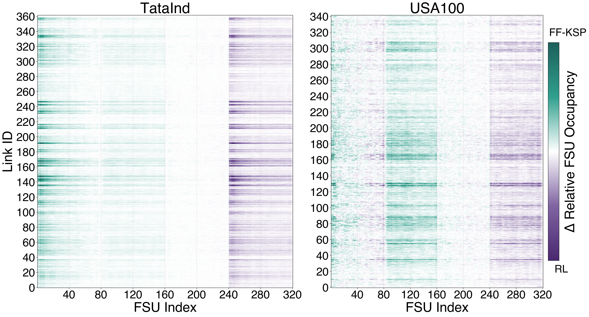

---

Reproduce all of the above with the commands in the [Graph Transformer paper reproduction guide](../reproduce_jocn_transformer.md).
